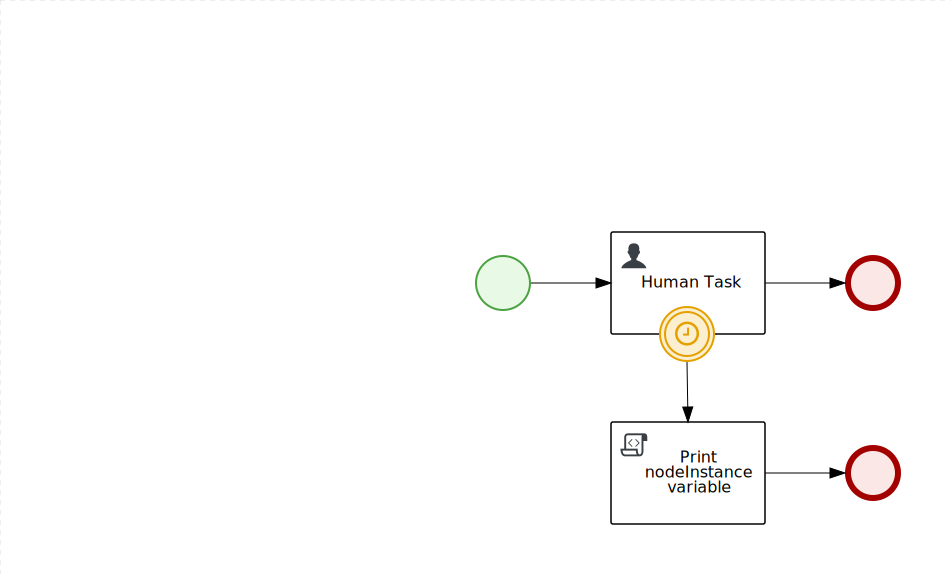
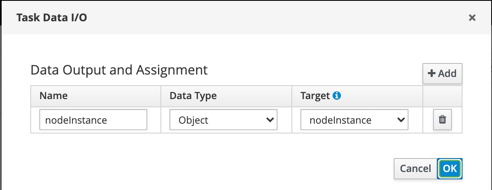

# HelloBoundaryIO
Repository to test access task details in boundary event. 

The new feature allows you to get information about the node on which a Boundary Event was triggered.

## The process


## How does it works

* Process has variable `nodeInstance` (can be any)
* When timer (PT1S which means after 1 second) on Human Task triggered Boundary Event maps node instance to the Process variable. To do it you can use `nodeInstance` predefined output variable name. See picture, where Name is predefined `nodeInstance` and can't be changed, Target is the process variable from the previous point and can be chaged togather with Process Variable name if needed.

* `Print nodeInstance variable` Script task printing variable to the console:

### The code in the Script Task
```java
if (nodeInstance != null) {
    System.out.println("nodeInstance variable's type is " + nodeInstance.getClass().toString());
    System.out.println("nodeInstance variable's value is " + nodeInstance.toString());
} else {
    System.out.println("nodeInstance process variable is null");
}
System.out.println("");
```

### Console output
```
09:45:37,013 INFO  [stdout] (EJB default - 2) nodeInstance variable's type is class org.jbpm.workflow.instance.node.HumanTaskNodeInstance
09:45:37,013 INFO  [stdout] (EJB default - 2) nodeInstance variable's value is org.jbpm.workflow.instance.node.HumanTaskNodeInstance@47871745
09:45:37,013 INFO  [stdout] (EJB default - 2)
```

### Sum up
For any Boundary Event, you can use `nodeInstance` predefined output variable name to pass the instance of the node Boundary Event was attached to the upper-level sub-process to use it later.

